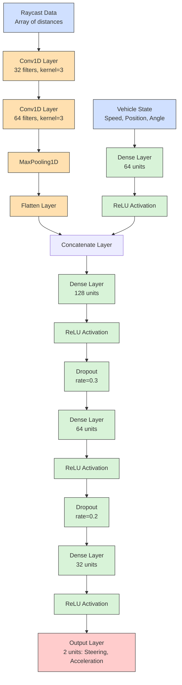

```mermaid
graph TD
    %% Input Layers
    A[Raycast Data<br/>Array of distances] --> B1[Conv1D Layer<br/>32 filters, kernel=3]
    B1 --> B2[Conv1D Layer<br/>64 filters, kernel=3]
    B2 --> B3[MaxPooling1D]
    B3 --> B4[Flatten Layer]

    C[Vehicle State<br/>Speed, Position, Angle] --> D1[Dense Layer<br/>64 units]
    D1 --> D2[ReLU Activation]

    %% Concatenation
    B4 --> E[Concatenate Layer]
    D2 --> E

    %% Common Processing
    E --> F1[Dense Layer<br/>128 units]
    F1 --> F2[ReLU Activation]
    F2 --> F3[Dropout<br/>rate=0.3]

    F3 --> G1[Dense Layer<br/>64 units]
    G1 --> G2[ReLU Activation]
    G2 --> G3[Dropout<br/>rate=0.2]

    %% Output Layers
    G3 --> H1[Dense Layer<br/>32 units]
    H1 --> H2[ReLU Activation]

    H2 --> I[Output Layer<br/>2 units: Steering, Acceleration]

    %% Add styling
    classDef inputClass fill:#d0e0ff,stroke:#333,stroke-width:1px
    classDef convClass fill:#ffe0b0,stroke:#333,stroke-width:1px
    classDef denseClass fill:#d8f3d8,stroke:#333,stroke-width:1px
    classDef outputClass fill:#ffcccc,stroke:#333,stroke-width:1px
    class A,C inputClass
    class B1,B2,B3,B4 convClass
    class D1,D2,F1,F2,F3,G1,G2,G3,H1,H2 denseClass
    class I outputClass
```